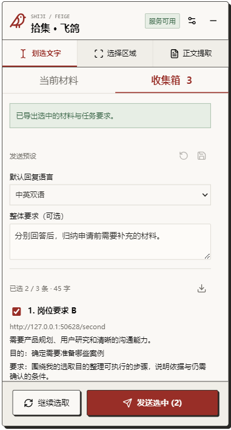

# 拾集 · 飞鸽 / Shiji Feige

本地运行的网页材料与 Agent 连接工具。跨网页收集内容，为每条材料添加目的、要求和回复语言，确认后一次交给你的 Agent。

## 版权与使用边界

本仓库的自有源代码以“源码公开，保留权利”为发布方式，不采用 MIT、Apache 等开源许可证。允许个人为自身使用而下载、安装并在本地运行本项目，包括为此所必需的复制；该许可不包含修改后再发布、对外分发、出售或提供商业托管服务。

除上述个人本地使用许可、适用法律、GitHub 服务条款或权利人另行书面授权外，其余权利均予保留，不另行授予复制、修改、分发或商业利用自有代码的许可。公开仓库仍允许 GitHub 用户按平台条款查看和 Fork，不能把“保留权利”理解为禁止这些平台许可的行为。其他用途请通过 GitHub Issues 联系项目方申请许可。参见 [GitHub 许可说明](https://docs.github.com/en/repositories/managing-your-repositorys-settings-and-features/customizing-your-repository/licensing-a-repository)。

`extension/vendor/` 和 `preview/vendor/` 中的第三方组件仍适用各自的许可证，见 [第三方组件说明](THIRD_PARTY_NOTICES.md)。第三方许可证不代表飞鸽自有代码采用同一许可证。

**当前为 0.3.0 源码预览。** 需要手动加载浏览器扩展、运行 Python 服务并配置 Agent；Windows 整合包与扩展商店版本尚未提供。

## 能做什么

- 划选文字、选择页面区域，或提取当前已加载的网页正文。
- 跨标签页收集多条材料，保留来源网址、标题与采集时间。
- 为每条材料指定目的、要求、回复语言，或标记为仅供参考。
- 编辑、勾选、排序材料，添加整体要求，统一发送一个任务包。
- 复制或导出 Markdown；通过本地 MCP 让 Agent 读取最终确认的快照。
- 复制包含准确批次 ID 的读取提示，查看该份材料的 MCP 读取回执。

飞鸽负责整理和传递，不直接调用大模型，也不会自动向外部聊天窗口发送消息。AI 分析由用户自己的 Agent 完成。



图为真实扩展测试界面的裁剪，使用本地合成材料，不包含用户网页记录。

## 运行方式

```text
网页 -> 飞鸽扩展（拾取、编辑、收集箱）
     -> 本地 HTTP 服务（确认发送后保存快照）
     -> Agent 调用 MCP 读取 -> 按逐条要求回答
```

无需飞鸽云账号或云端中转。材料交给 Agent 后，可能由 Agent 发送至其模型服务，因此本地中转不代表全部 AI 分析离线。

## 快速开始

前提：桌面 Chrome/Edge、Python 3.10+，以及支持 Streamable HTTP MCP 的 Agent。初次安装 Python 依赖需要网络；开发构建另需 Node。当前已测运行环境见 [开发与验证](docs/DEVELOPMENT.md)。

### 1. 下载源码

下载并解压本仓库源码，进入包含 `server/` 和 `extension/` 的目录。源码包已经包含构建好的扩展资源，运行采集功能无需先安装 Node。

### 2. 启动本地连接服务

在项目根目录执行：

```powershell
python -m pip install -r server/requirements.txt
python -m server.run
```

服务地址为 `http://127.0.0.1:8766`。保持窗口打开；关闭窗口会停止服务。已装好依赖的 Windows 用户也可以双击 `start-feige.cmd`，该脚本不会自动安装依赖。

### 3. 加载扩展

1. 打开 `edge://extensions` 或 `chrome://extensions`。
2. 开启开发者模式，点击“加载解压缩的扩展”。
3. 进入解压后的项目文件夹，再选择里面的 `extension` 子文件夹；该文件夹内应直接包含 `manifest.json`。
4. 打开普通网页，点击浏览器工具栏的飞鸽图标，在页面内启用悬浮入口。

例如下载 GitHub ZIP 后，目录结构为：

```text
shiji-feige-main/
  extension/          <- 在“加载解压缩的扩展”中选择这一层
    manifest.json
    src/
  server/
  README.md
```

如果出现“清单文件丢失或不可读取”，请取消报错窗口，重新点击“加载解压缩的扩展”，进入项目目录并选择 `extension`。不要选择外层的 `shiji-feige-main` 或 ZIP 文件；如果解压后多套了一层同名目录，请继续进入，直到找到直接包含 `manifest.json` 的 `extension` 文件夹。

页面刷新或导航后需重新启用。扩展商店和浏览器内部页面不支持注入。

### 4. 连接 Agent

在支持的客户端中添加名为 `feige` 的 Streamable HTTP MCP 服务，地址为：

```text
http://127.0.0.1:8766/mcp
```

完整步骤与 Codex 配置示例见 [MCP_SETUP.md](MCP_SETUP.md)。配置后应确认客户端实际列出 `get_selected_context` 工具。项目已验证官方 Python MCP 客户端读取；原生 Codex 客户端加载尚待独立验收，不能以服务在线代替工具加载成功。

### 5. 收集并发送

1. 拾取网页内容，填写这条材料的选取目的与要求，选择回复语言。
2. 点击“加入收集箱”，可以去其他网页继续收集。
3. 在收集箱里勾选、排序、编辑；可添加整体要求。
4. 点击“发送选中”，复制界面提供的“在 Agent 中读取”提示，粘贴到已连接的 Agent 对话。

“已保存”表示本地服务接收了材料；“MCP 已读取”表示读取工具被调用，不代表模型已完成回答。修改已提交的材料后，需要再次确认发送。

## 限制与数据处理

- 当前是单用户本地原型。服务没有配对鉴权，只能监听回环地址；不要映射到公网或多人共用。其他本机程序或扩展仍可能访问服务。
- 已入箱材料保存在浏览器扩展本地存储中，刷新后保留；未保存的当前编辑刷新会丢失。
- 已提交快照仅保留在服务内存中，最多 20 份；服务重启或清空操作会删除快照，不会删除浏览器收集箱。
- 每批最多 20 条，单条正文最多 10 万字符，总正文最多 20 万字符；超限会提示，不静默截断。
- 不读取 iframe、封闭 Shadow DOM、图片文字、未加载的内容或不可访问的付费页；尚未实现 PDF 解析和 OCR。
- 通用正文提取不保证适配每个站点；复杂弹窗、列表和页面布局需具体验证。首页选区可能只保留首页 URL，而非内容详情链接。
- 简单脱敏仅覆盖常见邮箱和大陆手机号。标题与网址仍会随材料传递，发送前需自行核对。
- 封闭 Shadow Root 提供局部 DOM 隔离，不是完整的安全边界。
- 不提供自动投递、自动发送聊天消息、云同步或 AI 结果回填。

建议使用公开或合成材料体验源码预览，避免在尚无访问授权的服务中存放敏感信息。

## 练习与开发

直接打开 `preview/capture.html` 可以练习采集，不会真实发送到 Agent。`preview/index.html` 是独立的模拟视觉演示，模拟状态不代表真实连接。

- [开发与验证](docs/DEVELOPMENT.md)
- [材料与任务结构](TASK_COLLECTION_DESIGN.md)
- [版本记录](CHANGELOG.md)
- [第三方组件说明](THIRD_PARTY_NOTICES.md)

后续顺序：完善本地连接与首次接入、提供经过验证的 Windows 整合包，再上架 Edge 和 Chrome。本次发布定位为源码预览，自有代码采用上述有限使用许可并保留其余权利；第三方组件保留各自许可证。
